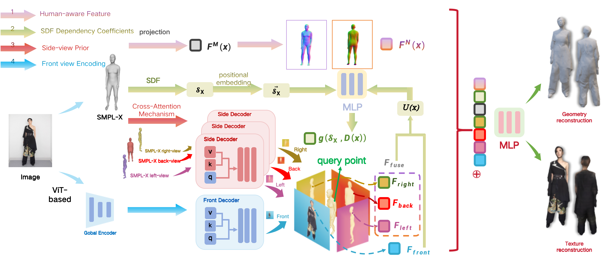

<h1 align="center">
Uncertainty-Aware Adjustment via Learnable Coefficients for Detailed 3D Reconstruction of Clothed Humans from Single Images
</h1>

<p align="center">
<b>
Yadan Yang<sup>1</sup>, Yunze Li<sup>1</sup>, 
<a href="https://fangli-ying.github.io/">Fangli Ying<sup>†1</sup></a>, 
<a href="https://myweb.cmu.ac.th/aniwat.ph/">Aniwat Phaphuangwittayakul<sup>2</sup></a>, 
and <a href="https://dhuny.org/">Riyad Dhuny<sup>3</sup></a>
</b>
</p>

<p align="center">
<sup>1</sup>School of Information Science and Engineering, East China University of Science and Technology, China  
<br>
<sup>2</sup>International College of Digital Innovation, Chiang Mai University, Thailand  
<br>
<sup>3</sup>University of Technology, Mauritius
</p>

<p align="center">
<i>Pacific Graphics 2025 · Computer Graphics Forum</i>
</p>

<p align="center">
  <a href="https://doi.org/10.1111/cgf.70239">
    
  </a>
  <a href="https://yyd0613.github.io/PG2025/">
    
  </a>
</p>

<p align="center">
  
</p>

---

<p align="center">
We adopt an implicit function-based framework to reconstruct high-fidelity clothed human geometry
from a single RGB image. Given an input image and the corresponding SMPL-X model, we first render multi-view normal maps and extract
side-view features using a cross-attention mechanism. These features are then fused across views to obtain a unified spatial representation. To
enhance robustness in loose clothing regions, we introduce a learnable dependency coefficient module, which adaptively adjusts the influence
of the SDF. Finally, by integrating the fusion features, normal features, and the modulated SDF, we predict the final 3D mesh.
</p>

---

### 📄 Citation
If you find this work useful, please consider citing:

```bibtex
@inproceedings{yang2025uncertainty,
  title={Uncertainty-Aware Adjustment via Learnable Coefficients for Detailed 3D Reconstruction of Clothed Humans from Single Images},
  author={Yang, Yadan and Li, Yunze and Ying, Fangli and Phaphuangwittayakul, Aniwat and Dhuny, Riyad},
  booktitle={Computer Graphics Forum},
  pages={e70239},
  year={2025},
  organization={Wiley Online Library}
}
